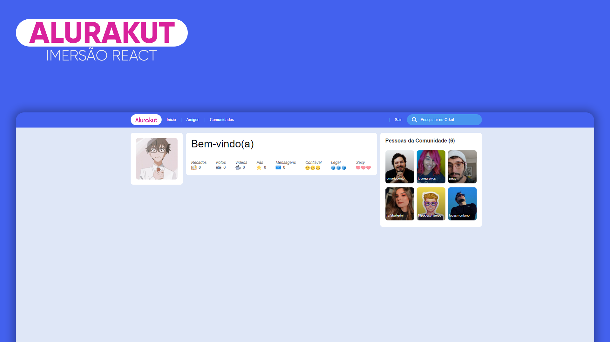

# Alurakut
Aplicação em desenvolvimento na imersãoReact da alura, algumas modificações no design feitas por mim :)

  

## Tecnologias

Esse projeto foi desenvolvido com as seguintes tecnologias:

- ReactJS
- NextJS
- Styled Components

## 💻 Projeto

O Alurakut é basicamente uma recriação do antigo orkut, usando tecnologias mais atuais e com um design mais moderno.

